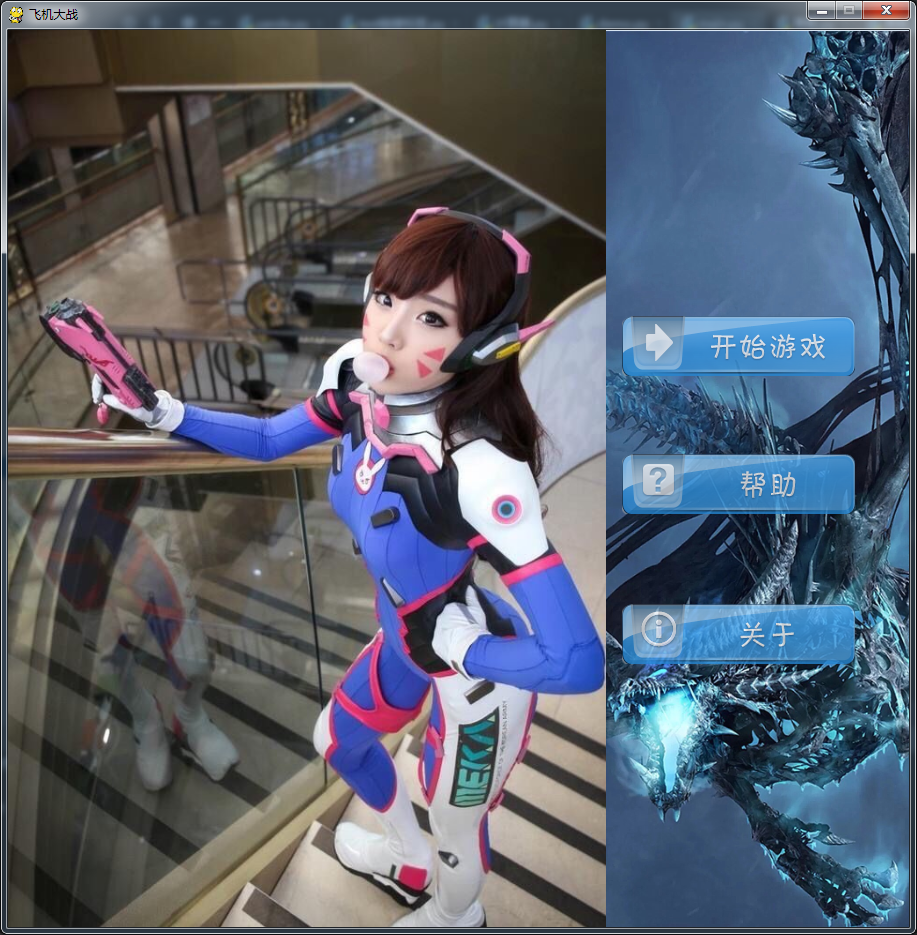
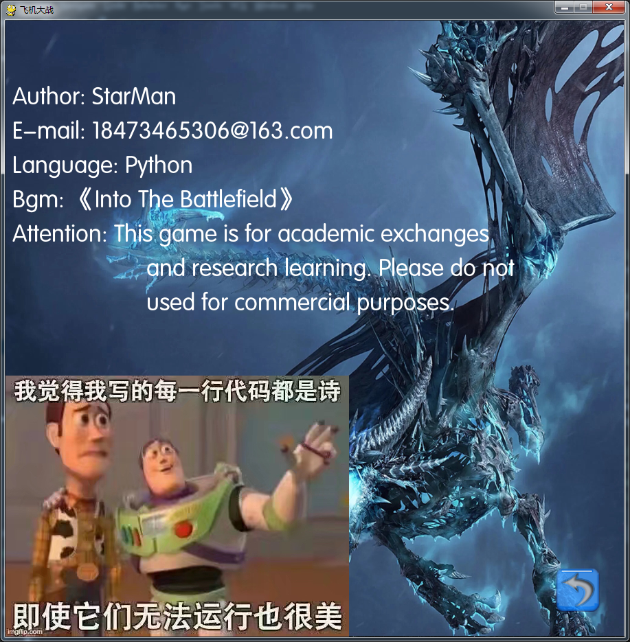
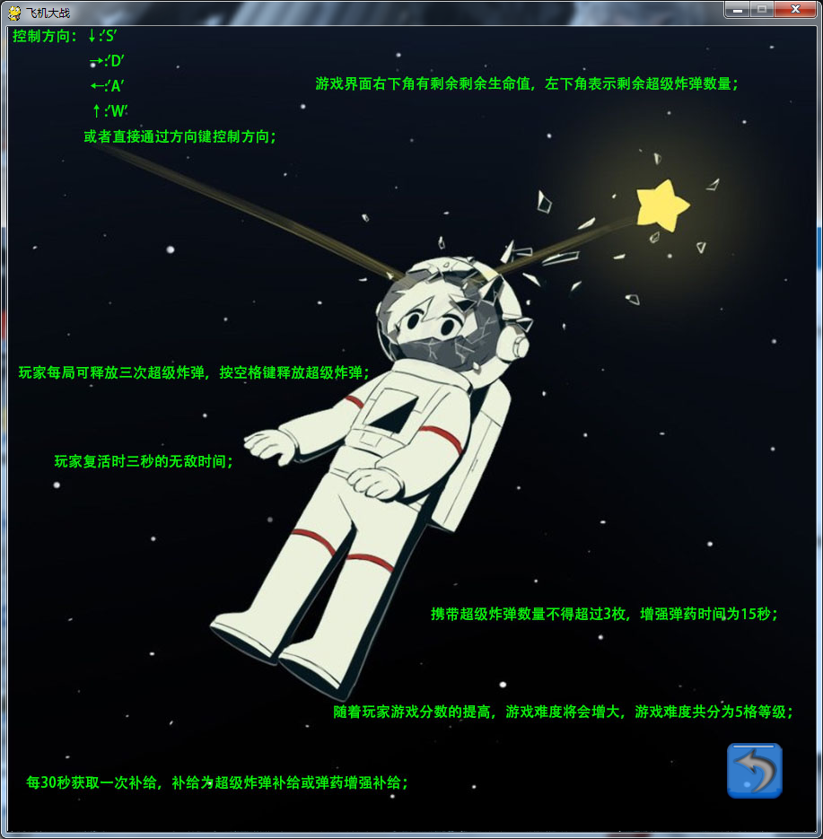
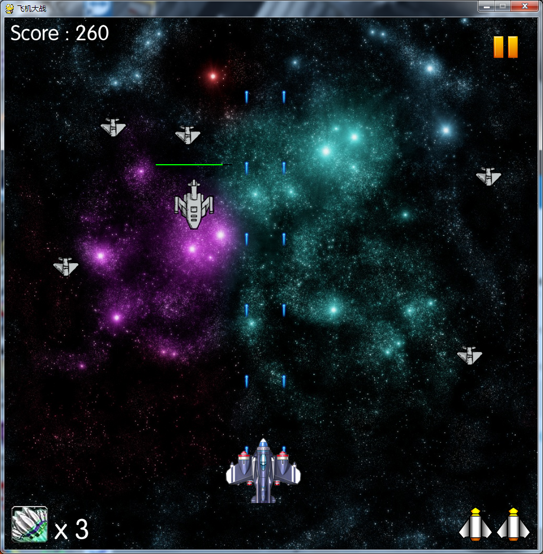
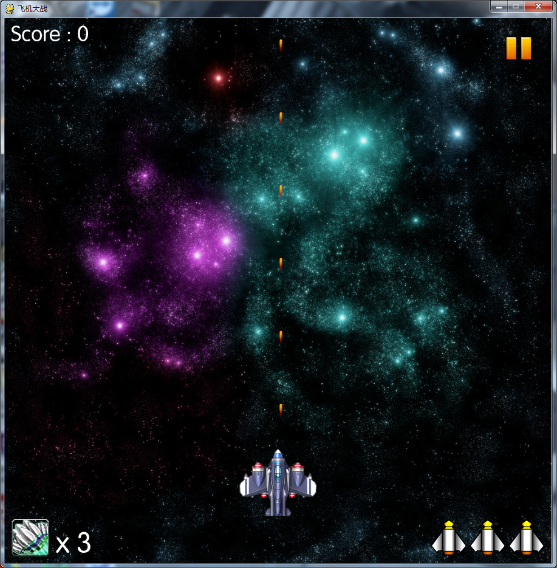
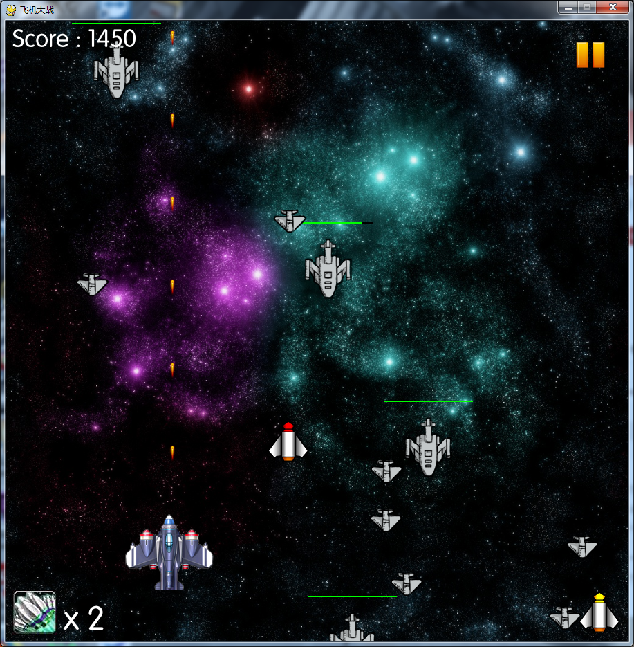

# PlaneWar
基于pygame的一款小游戏

这是我上半年做的一款小游戏，但是一直忘记了，现在才上传代码。 

代码基于pygame，Python版本3.5.2运行正常。 

游戏很简单，代码也很简单。 

主函数为main.py 

游戏内容大致就是在太空中驾驶一架飞机，与敌机展开战斗。
以下是开始的菜单界面：

关于界面：

帮助页面：

游戏开始时玩家拥有3次复活机会，和3个技能，按空格触发技能。技能的效果是消除屏幕内所有敌机。

随着游戏的进行，游戏的难道会有稍微增大，敌机的速度会加快，会出现更大的机型（敌机分为小、中、大三种）。我方每过30s会掉落补给，或是子弹增强，或是技能数量+1。

record.txt文件用来存放历史最高分数。 

image文件夹存放游戏的某些图片。 

font文件夹存放游戏的字体。 

sound文件夹存放游戏音效文件。 

以下是游戏截图： 

